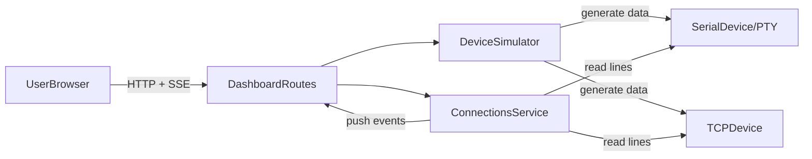

# Quantum Device Simulator

Modern control and data-acquisition demo designed to look like the software stack around a quantum hardware experiment.

The app lets you:

- **Simulate devices** that stream data over Serial (PTY) and TCP/IP.
- **Connect to any device** (simulated or real) via Serial or TCP and read its stream.
- **Monitor and visualize** data in real time with charts, statistics, and logs.
- **Toggle simulator behavior** (noise, drift) at runtime without restarting devices.

This is intended as a portfolio project for roles like the [Qubitrium Software Engineer](https://qubitrium.tech/job-ads/software-engineer): it demonstrates experimental control software, data acquisition, Serial/TCP/IP integration, and real-time GUIs.

---

## 1. Project overview

At a high level, the Quantum Device Simulator provides two main capabilities:

- A **Device Simulator** that spins up virtual devices which emit realistic data over:
  - **Serial** (via pseudo-terminals / PTYs).
  - **TCP** (via local TCP servers).
- A **Connections dashboard** that behaves like a small DAQ client:
  - Save named **connections** (Serial path or TCP host:port).
  - Open client connections, stream data into the browser using **Server-Sent Events (SSE)**.
  - Visualize incoming data with **Chart.js**, per-series statistics, and CSV export.

You can point the Connections dashboard at:

- The simulated devices provided by this project.
- Any other Serial/TCP source you want to demo (e.g. a lab instrument or another simulator).

---

## 2. High-level architecture

### 2.1 Components

- **Frontend (UI)**
  - Flask/Jinja2 templates under `templates/dashboard/`.
  - Sidebar navigation, cards, and tables built on the included Bootstrap-based admin theme.
  - **Chart.js 4.x** for real-time charts on the connection monitor page.
  - Vanilla JavaScript for SSE consumption, health checks, and reconnection.

- **Backend (Flask)**
  - Single Flask blueprint: [`dashboard/routes.py`](../dashboard/routes.py).
  - **Device simulator services**:
    - [`services/device_data.py`](../services/device_data.py): generates payloads for different device types, with optional noise and drift.
    - [`services/connection_manager.py`](../services/connection_manager.py): manages simulated devices:
      - Spawns TCP subprocesses and Serial PTY threads.
      - Pushes generated data into per-device monitor queues.
      - Exposes health checks and SSE monitor streams.
  - **Connections services**:
    - [`services/connection_store.py`](../services/connection_store.py): JSON-backed store for saved connections.
    - [`services/client_connector.py`](../services/client_connector.py): connects as a **client** to Serial/TCP endpoints and pushes lines into queues for SSE.

- **Processes / threads / IPC**
  - **TCP simulators** run in their own `multiprocessing.Process` so killing a TCP port doesn’t crash Flask.
  - **Serial simulators** run in background `threading.Thread`s writing to PTY master FDs.
  - **Connections client** readers (Serial/TCP) also run in dedicated threads.
  - **Queues** (`queue.Queue` and `multiprocessing.Manager().Queue()`) are used to feed monitor streams; HTTP responses use **SSE** to push updates into the browser.

### 2.2 Architecture diagram



---

## 3. Features

### 3.1 Device Simulator

Main UI: [`templates/dashboard/simulator.html`](../templates/dashboard/simulator.html)  
Backend: [`services/connection_manager.py`](../services/connection_manager.py), [`services/device_data.py`](../services/device_data.py)

- **Device types**
  - `sensor`: emits temperature/humidity style data.
  - `actuator`: emits state + sequence counters.
  - `satellite payload`: emits altitude and coordinates.
- **Connections**
  - **Serial**:
    - Uses a pseudo-terminal (PTY).
    - The simulator writes bytes to the PTY; you can attach external tools (e.g. `screen`, `cat`) to the slave side.
  - **TCP/IP**:
    - Each device binds a local TCP port and streams JSON lines to connected clients.
- **Simulator options**
  - **Noise**: Gaussian noise added to numeric values.
  - **Drift**: Slow sinusoidal drift to simulate drifting sensors.
  - Options can be toggled in real time from the simulator list or device monitor page; for TCP devices they update a shared config used by the TCP subprocess.

### 3.2 Monitor page (simulator devices)

UI: [`templates/dashboard/simulator_monitor.html`](../templates/dashboard/simulator_monitor.html)

- Shows:
  - Last payload as JSON.
  - Serial-formatted line.
  - TCP JSON line.
  - Last update timestamp.
- Uses **SSE** (`/dashboard/simulator/device/<id>/monitor/stream`) to receive a continuous stream without polling.
- Includes:
  - **Initial “connected” event**, so the UI can show “Connected, waiting for data…”.
  - **Heartbeat events** to keep connections alive through proxies.
  - **Device health polling** (separate endpoint) to detect when the simulator is powered off/on and to reconnect the stream automatically.

### 3.3 Connections dashboard

UI: `templates/dashboard/connections.html`, `templates/dashboard/connection_new.html`, `templates/dashboard/connection_edit.html`  
Backend: [`dashboard/routes.py`](../dashboard/routes.py), [`services/connection_store.py`](../services/connection_store.py), [`services/client_connector.py`](../services/client_connector.py)

- **Saved connections**
  - Each connection has:
    - `name`: display name.
    - `connection_type`: `Serial` or `TCP/IP`.
    - `address`: e.g. `/dev/ttys002` or `127.0.0.1:5001`.
    - `metadata`: parsed host/port/path and optional future parsing hints.
  - Stored in `data/connections.json` via `connection_store`.
- **Actions**
  - **Connect / Disconnect**: starts/stops a background thread that:
    - Opens a Serial port (or PTY path).
    - Or opens a TCP client socket to `host:port`.
    - Reads lines and pushes `{ raw, ts }` into a per-connection queue.
  - **Monitor**: opens the connection monitor page for that connection.
  - **Edit / Delete**: manage saved connection configs.
- **Status indicator**
  - Connections list polls `/dashboard/connections/<id>/status` to show “Connected” / “Disconnected”.

### 3.4 Connection monitor page (charts + stats)

UI: [`templates/dashboard/connection_monitor.html`](../templates/dashboard/connection_monitor.html)

- **Raw log**
  - Rolling buffer of the last 100 lines with server-side timestamps.
  - Useful to show exactly what’s coming off Serial/TCP.
- **Real-time chart (Chart.js)**
  - Data comes from `/dashboard/connections/<id>/stream` (SSE).
  - **Smart parsing**:
    - If the line starts with `{`: parse as JSON and extract all numeric fields.
    - Else:
      - Treat the line as CSV-like.
      - Prefer `name, value` pairs (e.g. `TEMP,25.3,HUM,45.2,TS,123.4`).
      - If a header row (e.g. `TEMP,HUM,TS`) appears, the next purely numeric row is mapped by position.
  - **Series selection**:
    - Detected numeric properties (e.g. `TEMP`, `HUM`, `TS`) appear as checkboxes.
    - Only selected series are plotted on the chart.
    - Stats (current/min/max/avg/count) are computed per series over a rolling window.
- **Export**
  - “Export CSV” button downloads the current raw-log buffer as `timestamp,raw`.

### 3.5 Documentation page

UI: [`templates/dashboard/documentation.html`](../templates/dashboard/documentation.html)  
Backend: `dashboard/routes.py` (`/dashboard/documentation`)

- Renders Markdown files from the `documentation/` directory inside the app.
- This `README.md` is what you see when you open the “Documentation” link in the sidebar.
- Additional docs can be added as new `.md` files and served via `/dashboard/documentation/<filename>.md`.

---

## 4. Technology stack

| Layer       | Technology                                  | Where it’s used                                            |
| ----------- | ------------------------------------------- | ---------------------------------------------------------- |
| Backend     | Python 3.x, Flask 3.x                       | Core web app, routes, SSE endpoints                        |
| Templates   | Jinja2                                      | All HTML under `templates/`                                |
| UI / Layout | Bootstrap-based admin theme (CSS/JS bundle) | Navigation, cards, tables, forms                           |
| Charts      | Chart.js 4.x                                | Connection monitor real-time charts                        |
| Concurrency | `threading`, `multiprocessing`, `queue`     | Device simulators, client connectors, monitor dispatcher   |
| Streaming   | Server-Sent Events (SSE)                    | Simulator monitor, connections monitor, logs stream        |
| Transport   | `socket`, PTY/Serial                        | TCP simulators/clients, Serial simulators/clients          |
| Persistence | JSON files in `data/`                       | Devices (`devices.json`), connections (`connections.json`) |
| Markdown    | `markdown` Python library                   | Rendering docs in `/dashboard/documentation`               |

---

## 5. Data flow and real-time behavior

### 5.1 Simulated device data flow

1. You create a device in the Device Simulator UI.
2. The config is stored in `data/devices.json` via `services/store.py`.
3. When powered on:
   - `connection_manager.start_device` launches:
     - A **Serial PTY thread** (for Serial devices).
     - Or a **TCP subprocess** (for TCP devices).
4. The simulator loop calls `device_data.get_payload` on a schedule, then:
   - Formats payloads for Serial (`format_serial`) and TCP (`format_tcp`).
   - Writes data to the PTY or TCP socket.
   - Pushes payload snapshots into monitor queues for the device.
5. The dashboard’s monitor SSE endpoint:
   - Reads from the per-device queue.
   - Streams events to the browser (`simulator_monitor.html`), which updates the UI.

### 5.2 External connection data flow

1. You define a **Connection** in the Connections UI; it’s saved in `data/connections.json`.
2. When you click **Connect** or open **Monitor**:
   - `client_connector.start_connection(connection_id)`:
     - For **Serial**: opens the configured path (or PTY) and reads lines.
     - For **TCP**: `socket.create_connection((host, port))` and reads line-by-line.
   - Each line is timestamped (`time.time()`) and put into an in-memory queue.
3. `/dashboard/connections/<id>/stream`:
   - Grabs a queue for that connection.
   - Emits each `{ raw, ts }` as SSE `data: ...`.
4. `connection_monitor.html`:
   - Appends each line to the raw log.
   - Parses values, updates the chart and stats in real time.

---

## 6. File and module structure

High-level layout (only the most important parts):

```text
quantum-device-simulator/
  dashboard/
    routes.py                # Flask blueprint and all dashboard routes
  services/
    connection_manager.py    # Simulated devices (Serial/TCP), monitor queues, health
    device_data.py           # Payload generation with noise/drift
    client_connector.py      # Client connections to Serial/TCP devices
    store.py                 # Device store (devices.json)
    connection_store.py      # Connection store (connections.json)
    device_logs.py           # Device log management
  templates/
    dashboard/
      index.html             # Landing page
      simulator.html         # Device list and controls
      simulator_monitor.html # Device simulator monitor page
      connections.html       # Connections list
      connection_new.html    # New connection form
      connection_edit.html   # Edit connection form
      connection_monitor.html# Connection monitor (logs, charts, stats)
      documentation.html     # Renders Markdown documentation
    partials/
      _sidebar.html          # Sidebar navigation
  data/
    devices.json             # Simulated device configs (ignored by git)
    connections.json         # Saved connections (ignored by git)
  documentation/
    README.md                # This documentation
  requirements.txt           # Python dependencies
```

Key modules:

- [`services/connection_manager.py`](../services/connection_manager.py): manages simulated devices (creation, power-on/off, queues, subprocesses, health checks).
- [`services/client_connector.py`](../services/client_connector.py): connects to external devices, reads streams, and feeds the connection monitor.

---

## 7. Running the project

### 7.1 Prerequisites

- Python 3.11+ (recommended).
- A Unix-like environment for PTYs (macOS, Linux). On Windows, TCP-based parts work; Serial PTY behavior may differ.

### 7.2 Install dependencies

From the project root:

```bash
python -m venv .venv
source .venv/bin/activate        # On Windows: .venv\\Scripts\\activate
pip install -r requirements.txt
```

### 7.3 Run the app

Typical Flask setup (adapt if you already have an entrypoint):

```bash
export FLASK_APP=app.py          # or the appropriate factory/module
export FLASK_ENV=development
flask run
```

Then open `http://127.0.0.1:5000/dashboard/` in your browser.

> Note: In your own fork you may already have a different startup script (e.g. `python main.py`); adjust this section accordingly.

---

## 8. Usage walkthrough

This walkthrough is designed for someone evaluating the project (e.g. at Qubitrium) and should take just a few minutes.

### 8.1 Create and monitor a simulated device

1. Go to **Device Simulator** in the sidebar.
2. Click **Create device**:
   - Choose type `sensor`.
   - Choose connection type `Serial` or `TCP/IP`.
   - Optionally set connection parameters (baud rate, TCP port).
3. Power on the device from the device list.
4. Click **Monitor**:
   - Watch the payload JSON, Serial line, and TCP line update in real time.
   - Toggle **Noise** and **Drift** and see the effect on the data.

### 8.2 Quick-add to connections and external-style monitoring

1. From the device list, use **Add to connections** to create a saved connection pointing at the device’s Serial path or TCP host:port.
2. Go to **Connections**:
   - See your new connection with status.
   - Click **Monitor**.
3. On the connection monitor page:
   - Observe **Raw log** filling with lines like `SENSOR,TEMP,25.3,HUM,45.2,TS,123.4`.
   - In **Chart series**, enable/disable series (TEMP, HUM, TS) and watch the chart update.
   - Inspect **Statistics** to see current/min/max/average values.
   - Click **Export CSV** to download the recent log for analysis.

This workflow mirrors a mini experimental setup: simulated hardware producing data, client software consuming and visualizing it in real time.

---

## 9. Extensibility and future work

Ideas for extending the project:

- **New device types**
  - Extend `device_data.get_payload` to add new payload shapes (e.g. qubit readout, photon counts).
  - Add corresponding Serial/TCP formats if needed.

- **Custom parsing / charting**
  - Use per-connection `metadata` (e.g. `format: "json"`, `chart_keys: ["temp", "humidity"]`) to control how lines are parsed and which fields are plotted.

- **More protocols**
  - Add support for additional transports (e.g. WebSockets, UDP) or higher-level protocols used in lab equipment.

- **Persistence and analysis**
  - Persist time-series data to disk (e.g. Parquet or InfluxDB) for offline analysis.
  - Add more advanced statistics and filtering (FFT, rolling windows).

- **Testing & CI**
  - Add unit tests for data generators, parsers, and routes.
  - Wire up a simple CI pipeline (GitHub Actions) to run tests and linting.

---

## 10. Appendix (selected routes and configuration)

### 10.1 Key routes (non-exhaustive)

- `/dashboard/` — Dashboard landing page.
- `/dashboard/simulator` — Device simulator management.
- `/dashboard/simulator/device/<id>/monitor` — Simulated device monitor page.
- `/dashboard/simulator/device/<id>/monitor/stream` — SSE stream for simulated device payloads.
- `/dashboard/connections` — Connections list.
- `/dashboard/connections/<id>/monitor` — Connection monitor (logs + charts).
- `/dashboard/connections/<id>/stream` — SSE stream of connection lines.
- `/dashboard/documentation` — Documentation page rendering this file.

### 10.2 Configuration notes

- **Local persisted data**
  - `data/devices.json` and `data/connections.json` are git-ignored so local setups don’t conflict.
- **Ports**
  - Device TCP ports are configured per device in connection parameters.
  - Flask’s port is controlled by how you run the app (`flask run --port 5000`, etc.).

This documentation should give a reviewer a clear picture of what the project does, how it is structured, and why it is a good fit for real-time experimental control and data acquisition work.
